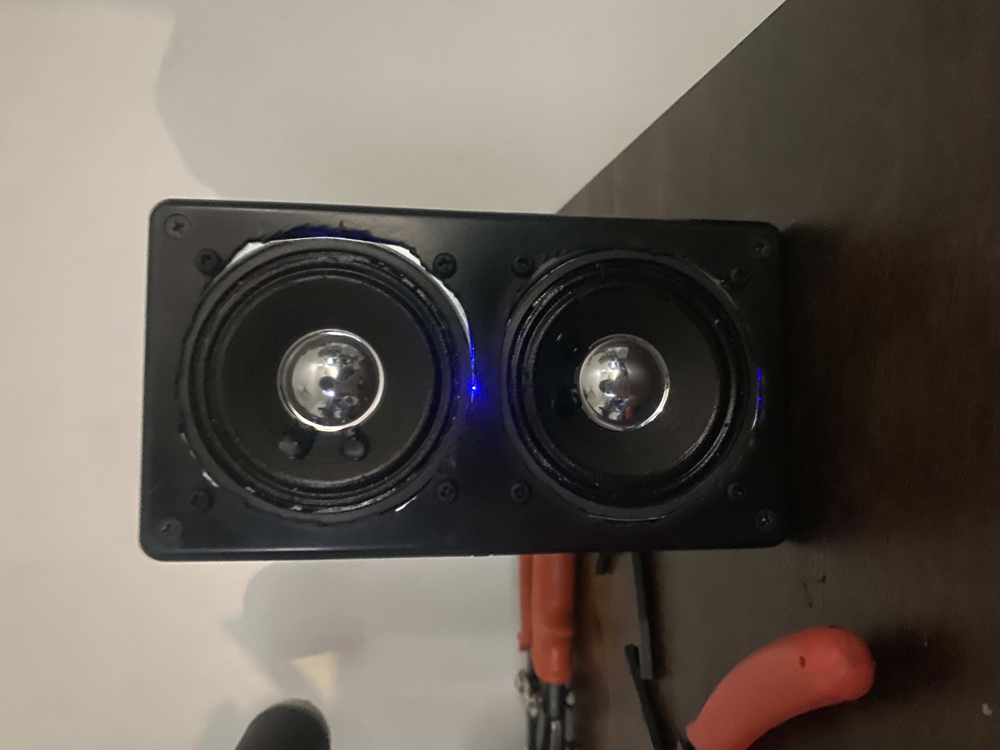

# JF-Audio

A multi-generation Bluetooth speaker engineering project documenting the complete design process from prototype to custom PCB and beyond.

<p align="center">
  
</p>

This project follows the development of a portable Bluetooth speaker through multiple design iterations, beginning with a breadboard prototype and progressing toward a custom PCB-based system.

## Project Overview

JF-Audio is a personal electrical engineering project focused on designing and
developing a portable Bluetooth speaker system through multiple hardware
revisions.

The project began as a breadboard-based prototype using off-the-shelf modules
and has progressed into a custom PCB-based design integrating Bluetooth audio,
stereo amplification, rechargeable battery power, and enclosure development.

Each version of the project builds upon lessons learned from the previous
design.

---

## Project Generations

## Version 1 — Breadboard Prototype

The first version of JF-Audio was constructed using off-the-shelf modules and a breadboard to validate the Bluetooth audio system before designing custom hardware.

<p align="center">
  
</p>

The prototype was used to verify Bluetooth connectivity, stereo audio output, power distribution, and overall system functionality.

Key accomplishments:

- Bluetooth audio connectivity
- Stereo speaker output
- PAM8403 amplifier module integration
- Portable battery-powered operation
- Functional enclosure prototype

[View Version 1](Version-1_Prototype/)

---

## Version 2 — Custom PCB

Version 2 replaces the breadboard-based audio circuitry with a custom PCB designed in EasyEDA. The board integrates the PAM8403 stereo audio amplifier, passive components, Bluetooth connections, speaker outputs, and power connections.

<p align="center">
  
</p>

Version 2 transitioned JF Audio from a breadboard prototype into a custom
hardware platform.

The design introduced a custom PAM8403 amplifier PCB, rechargeable Li-ion
power system, battery protection, external power control, and a fully
integrated portable enclosure.

**Key accomplishments:**
- Custom PAM8403 amplifier PCB
- PCB manufacturing and hand assembly
- Rechargeable 18650 Li-ion power system
- Battery protection integration
- PowerBoost 1000C charging and power management
- External power switch
- Stereo Bluetooth playback
- Extended battery-powered playback testing
- Complete enclosure integration

[View Version 2](Version-2_Custom-PCB/)

---

### Version 3 — Integrated Product Design

**Planned**

Version 3 will focus on improving the mechanical and electronic integration
of JF Audio based on lessons learned during Version 2.

Planned development includes:
- Custom 3D-printed enclosure
- Purpose-designed component mounting locations
- Improved external connector integration
- Physical audio controls
- Improved audio processing
- More integrated electronics

### Version 4 — Advanced Embedded Audio System

**Planned**

Version 4 is intended to expand JF Audio into an advanced embedded audio
platform incorporating DSP, embedded control, system telemetry, display
integration, and deeper custom electronics.

### Version 5 — Advanced Hardware Platform

**Long-Term Concept**

Version 5 is intended to explore deeper custom hardware development,
advanced audio processing, custom display electronics, and increasingly
integrated system architecture.

---

## Development Progress

**Version 1:** Complete  
**Version 2:** Hardware bring-up and enclosure integration in progress  
**Version 3:** Concept development

Version 2 has successfully demonstrated Bluetooth connectivity and stereo
audio operation using the custom PCB. Power-system integration and final
mechanical assembly are currently in progress.

---

## Engineering Areas

This project includes practical experience with:

- PCB schematic capture and layout
- EasyEDA
- PAM8403 Class-D audio amplification
- Bluetooth audio integration
- Lithium-ion battery power systems
- DC-DC power conversion
- Soldering and hardware assembly
- Digital multimeter testing
- PCB bring-up
- Hardware troubleshooting
- Enclosure design
- Design-for-assembly considerations
- Engineering documentation

---

## Repository Structure

```text
JF-Audio/
│
├── Version-1_Prototype/
│   └── Original breadboard-based Bluetooth speaker
│
├── Version-2_Custom-PCB/
│   └── Custom PCB design, hardware testing, and enclosure development
│
├── Version-3_Concept/
│   └── Future design concepts and improvements
│
├── LICENSE
└── README.md
