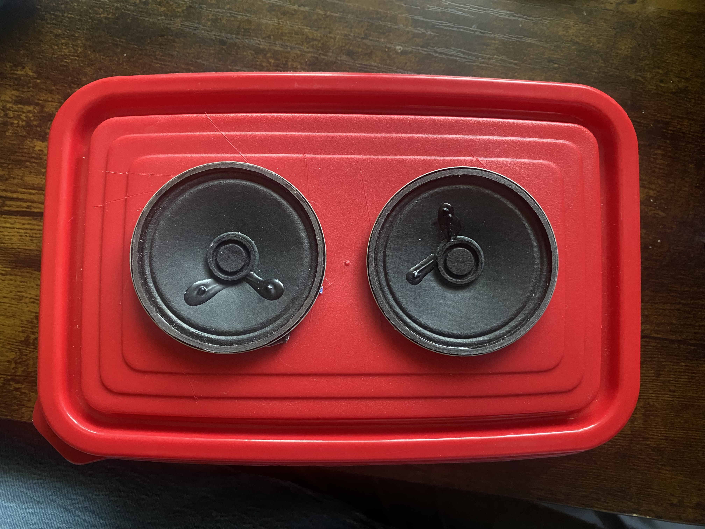
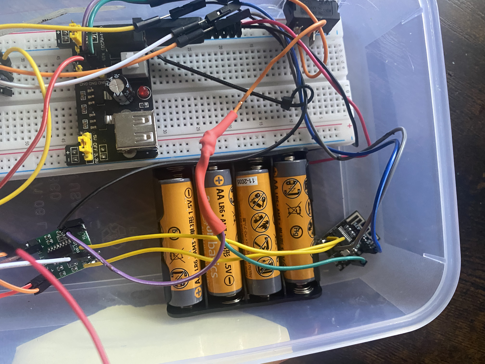
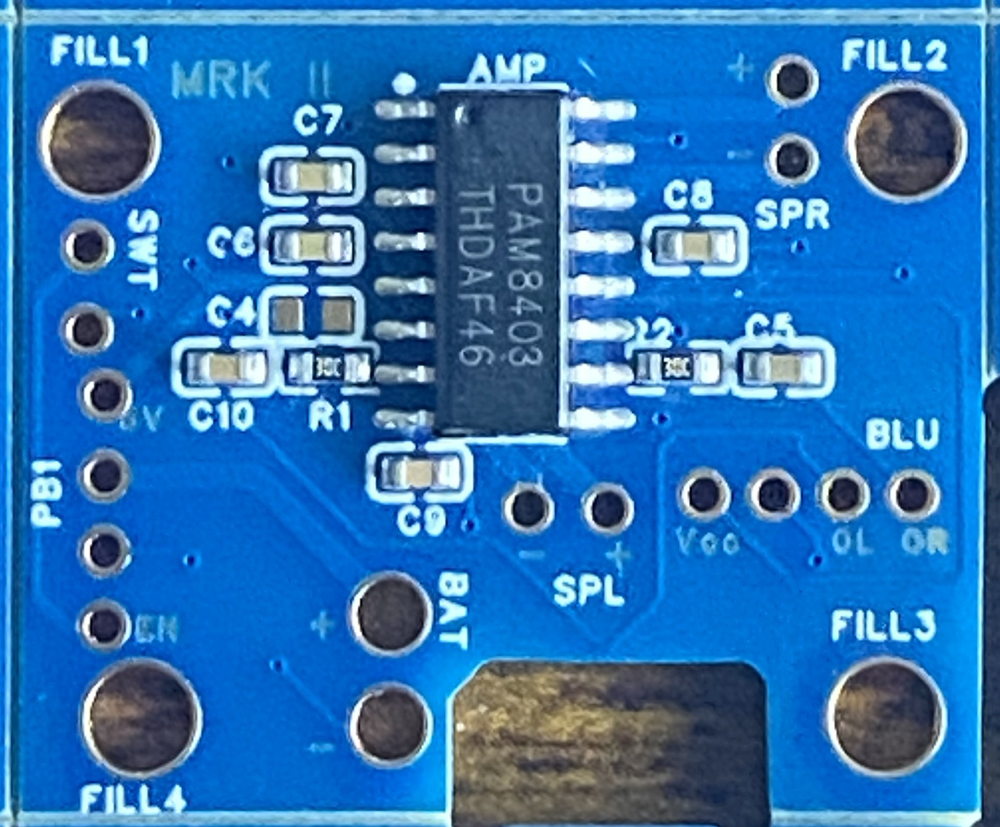

# JF-Audio

A multi-generation Bluetooth speaker engineering project documenting the complete design process from prototype to custom PCB and beyond.

<p align="center">
  
</p>

This project follows the development of a portable Bluetooth speaker through multiple design iterations, beginning with a breadboard prototype and progressing toward a custom PCB-based system.
## Project Overview

JF-Audio is a personal electrical engineering project focused on designing and
developing a portable Bluetooth speaker system through multiple hardware
revisions.

The project began as a breadboard-based prototype using off-the-shelf modules
and has progressed into a custom PCB-based design integrating Bluetooth audio,
stereo amplification, rechargeable battery power, and enclosure development.

Each version of the project builds upon lessons learned from the previous
design.

---

## Project Generations

## Version 1 — Breadboard Prototype

The first version of JF-Audio was constructed using off-the-shelf modules and a breadboard to validate the Bluetooth audio system before designing custom hardware.

<p align="center">
  
</p>

The prototype was used to verify Bluetooth connectivity, stereo audio output, power distribution, and overall system functionality.

Key accomplishments:

- Bluetooth audio connectivity
- Stereo speaker output
- PAM8403 amplifier module integration
- Portable battery-powered operation
- Functional enclosure prototype

[View Version 1](Version-1_Prototype/)

---

## Version 2 — Custom PCB

Version 2 replaces the breadboard-based audio circuitry with a custom PCB designed in EasyEDA. The board integrates the PAM8403 stereo audio amplifier, passive components, Bluetooth connections, speaker outputs, and power connections.

<p align="center">
  
</p>

The PCB was designed, fabricated, assembled, and tested as part of the development process. Hardware testing is currently ongoing, including power-system integration and troubleshooting.

The design integrates a PAM8403 stereo amplifier IC with the Bluetooth audio
receiver and introduces a rechargeable lithium-ion power architecture.

Current accomplishments:

- Custom schematic and PCB designed in EasyEDA
- PCB manufactured and manually assembled
- PCB continuity verified
- Approximately 5.1 V initial power testing completed
- Bluetooth receiver successfully powered and paired
- Left audio channel successfully tested
- Right audio channel successfully tested
- Stereo audio output successfully demonstrated
- Hardware bring-up and troubleshooting documented

Current development:

- Adding dedicated 1S lithium-ion battery protection
- Replacing and retesting the PowerBoost 1000C
- Completing power-switch integration
- Completing enclosure assembly
- Performing final system and extended playback testing

[View Version 2](Version-2_Custom-PCB/)

---

### Version 3 — Concept

Version 3 is being developed from lessons learned during the design,
assembly, and testing of Version 2.

Planned improvements include:

- Improved PCB component spacing
- Easier access to external solder connections
- Improved test-point accessibility
- Better manufacturability and serviceability
- Improved enclosure integration
- Further power-system improvements

[View Version 3 Concepts](Version-3_Concept/)

---

## Development Progress

**Version 1:** Complete  
**Version 2:** Hardware bring-up and enclosure integration in progress  
**Version 3:** Concept development

Version 2 has successfully demonstrated Bluetooth connectivity and stereo
audio operation using the custom PCB. Power-system integration and final
mechanical assembly are currently in progress.

---

## Engineering Areas

This project includes practical experience with:

- PCB schematic capture and layout
- EasyEDA
- PAM8403 Class-D audio amplification
- Bluetooth audio integration
- Lithium-ion battery power systems
- DC-DC power conversion
- Soldering and hardware assembly
- Digital multimeter testing
- PCB bring-up
- Hardware troubleshooting
- Enclosure design
- Design-for-assembly considerations
- Engineering documentation

---

## Repository Structure

```text
JF-Audio/
│
├── Version-1_Prototype/
│   └── Original breadboard-based Bluetooth speaker
│
├── Version-2_Custom-PCB/
│   └── Custom PCB design, hardware testing, and enclosure development
│
├── Version-3_Concept/
│   └── Future design concepts and improvements
│
├── LICENSE
└── README.md
