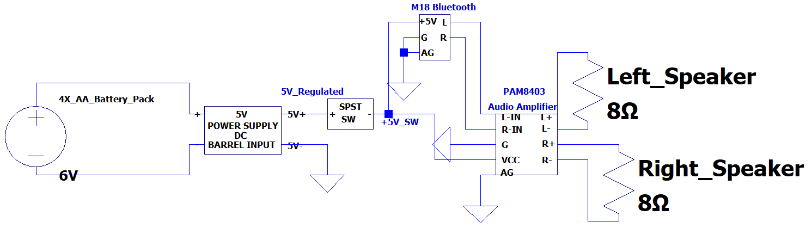

# JF Audio Version 1 - Prototype

## Overview

Version 1 of JF Audio was the first working prototype of my portable Bluetooth speaker project. The goal of this version was to build a functional Bluetooth speaker using off-the-shelf modules and readily available materials before moving toward a custom PCB design.

The electronics were assembled primarily using a breadboard and jumper wires and were housed inside a modified plastic food container. Two 8-ohm, 1-watt speakers were mounted to the lid of the enclosure.

This prototype served as a proof of concept and provided experience with Bluetooth audio, audio amplification, battery-powered electronics, soldering, power distribution, grounding, and physical assembly.

---

## Design Goals

- Build a functional portable Bluetooth speaker
- Learn how Bluetooth audio modules and audio amplifiers interface
- Develop experience with power distribution and grounding
- Practice soldering and hardware assembly
- Create a portable enclosure for the electronics
- Identify limitations that could be improved in future revisions
- Use the prototype as a foundation for a future custom PCB design

---

## Features

- Wireless Bluetooth audio playback
- Two-channel stereo audio
- Two 8-ohm, 1-watt speakers
- Battery-powered portable operation
- External SPST rocker power switch
- Breadboard-based electronics
- Modified food-container enclosure

---

## System Architecture

The Version 1 audio system consists of four main sections: the battery and power supply, Bluetooth receiver, audio amplifier, and speakers.

Four AA batteries provide approximately 6 V nominal to a 5 V power supply module. The power supply provides a regulated 5 V output for the speaker electronics. An external SPST rocker switch is placed in the regulated power path to provide user-accessible power control.

The M18 Bluetooth module receives wireless audio from a Bluetooth-enabled device and provides separate left and right analog audio signals. These signals are connected to the left and right inputs of the PAM8403 stereo Class-D audio amplifier.

The PAM8403 amplifies the two audio channels and drives two 8-ohm, 1-watt speakers.

### Signal and Power Flow

`4x AA Batteries (6 V) → 5 V Power Supply → SPST Switch → Bluetooth Receiver / Audio Amplifier → Speakers`

---

## Circuit Schematic

The complete Version 1 electrical system is shown below.

The original LTspice schematic and the custom LTspice symbols used to create the diagram are included in the `Schematics` directory.

The schematic documents the major electrical connections between:

- 4x AA battery pack
- 5 V power supply
- SPST rocker switch
- M18 Bluetooth module
- PAM8403 stereo audio amplifier
- Left 8-ohm speaker
- Right 8-ohm speaker

The PAM8403 uses differential speaker outputs, with each speaker connected between the positive and negative output terminals of its respective amplifier channel.

---

## Internal Electronics

Version 1 used a breadboard-based design with individual modules connected using jumper wires. This approach allowed the circuit to be modified and troubleshot easily during development.

Although this worked well for prototyping, the large number of individual wires and separate modules increased the amount of space required inside the enclosure. This became one of the primary motivations for developing a custom PCB in Version 2.

---

## Breadboard Wiring

The amplifier, Bluetooth receiver, and power circuitry were interconnected using a combination of breadboard connections, jumper wires, and soldered wiring.

The breadboard approach provided flexibility during initial testing and made it possible to verify the operation of individual sections of the speaker before creating a more permanent design.

---

## Module Connections

Individual modules were connected using jumper wires and soldered connections. This allowed the Bluetooth receiver, audio amplifier, speakers, and power system to operate as a complete system while still allowing components to be disconnected or modified during troubleshooting.

---

## Power System

Version 1 uses four AA batteries connected in series, providing approximately 6 V nominal.

The battery pack supplies a 5 V power supply module, which provides regulated 5 V power for the Bluetooth receiver and audio amplifier.

Version 1 does **not** include an integrated rechargeable battery system.

The original design considered using an Adafruit PowerBoost 1000C to provide regulated power and battery charging. However, the PowerBoost could not be implemented in Version 1 because the required materials were not available during the original build.

Instead, the prototype uses the available battery power hardware. The internal power module must first be activated using its onboard push button before power is supplied through the external rocker switch.

Once the internal power module is activated, the external rocker switch provides user-accessible control of power to the speaker electronics.

This arrangement successfully powered the prototype but introduced two important limitations:

1. The enclosure may need to be opened to access the internal power-module button.
2. The speaker does not provide an integrated method for recharging its batteries.

Both limitations became design goals for Version 2.

---

## Lessons Learned

Version 1 successfully demonstrated that the overall Bluetooth speaker concept could work while also revealing several areas for improvement.

- Breadboard and jumper-wire construction requires significant enclosure space.
- Large amounts of wiring make assembly and troubleshooting more difficult.
- Proper grounding and power distribution are important for minimizing unwanted audio noise.
- Component placement and wire management significantly affect the organization of the final assembly.
- A dedicated PCB can reduce wiring and improve reliability.
- A purpose-built enclosure can provide better component mounting and a cleaner finished product.
- The internal battery module requires manual activation before the external power switch can operate.
- The lack of integrated battery charging reduces the convenience of the portable design.
- Building a functional prototype before designing a PCB helped identify electrical and mechanical improvements for the next version.

These observations directly influenced the development of **JF Audio Version 2**.

---

## Version Progression

### Version 1 - Prototype

Breadboard-based electronics, off-the-shelf modules, hand wiring, battery-powered operation, two 8-ohm 1-watt speakers, and a modified food-container enclosure.

**Primary objective:** Prove that the Bluetooth speaker concept works.

↓

### Version 2 - Custom PCB

Custom PCB design, dedicated plastic enclosure, improved component organization, reduced wiring, and an Adafruit PowerBoost 1000C providing an integrated rechargeable battery power system.

**Primary objective:** Transform the working prototype into a cleaner and more integrated hardware design.

↓

### Version 3 - Future Development

Future improvements are currently being explored, with potential focus areas including improved audio performance, greater hardware integration, enhanced power management, custom enclosure design, and additional user features.

---

## Status

**Complete**
