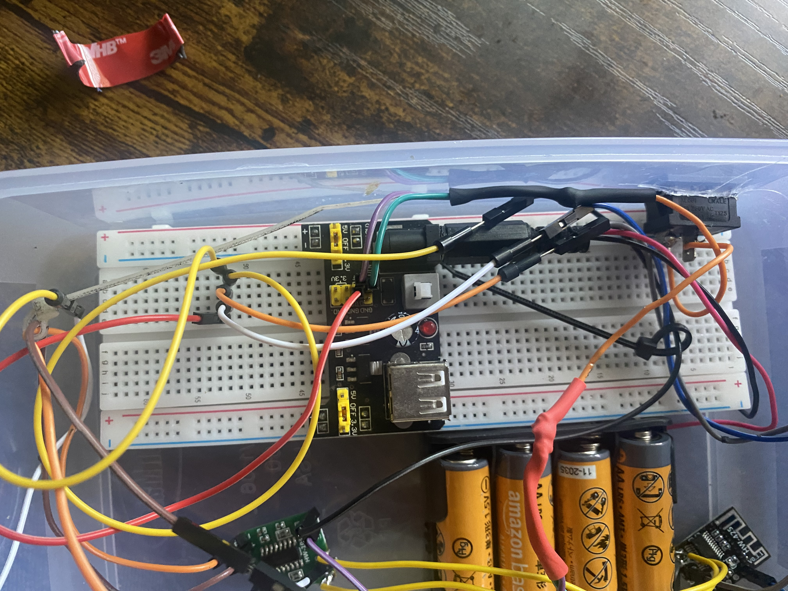
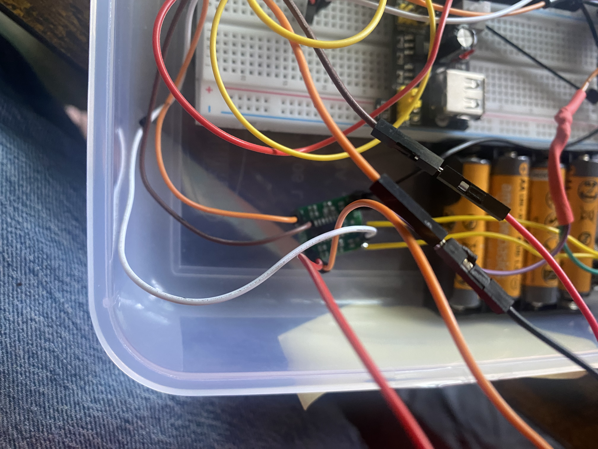
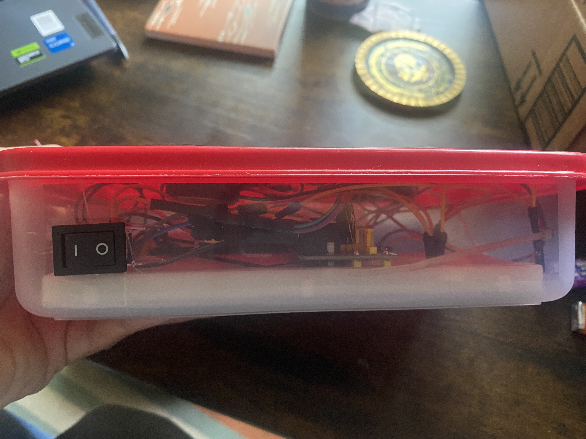

# JF Audio Version 1 - Prototype

## Overview

Version 1 of JF Audio was the first working prototype of my portable Bluetooth speaker project. The goal of this version was to build a functional Bluetooth speaker using off-the-shelf modules and readily available materials before moving toward a custom PCB design.

The electronics were assembled primarily using a breadboard and jumper wires and were housed inside a modified plastic food container. Two 8-ohm, 1-watt speakers were mounted to the lid.

## Design Goals

- Build a functional portable Bluetooth speaker
- Learn how Bluetooth audio modules and audio amplifiers interface
- Develop experience with power distribution and grounding
- Practice soldering and hardware assembly
- Create a portable enclosure for the electronics
- Identify improvements for a future PCB-based design

## Finished Prototype

The completed Version 1 prototype uses two speakers mounted directly to the lid of the enclosure.

## Internal Electronics

The first version used a breadboard-based design with individual modules connected using jumper wires. This approach made it easy to modify and troubleshoot the circuit during development.

### Breadboard Wiring

### Module Connections

### Power Switch

An external switch was added to allow the speaker electronics to be turned on and off without opening the enclosure.

## Lessons Learned

Version 1 demonstrated that the overall Bluetooth speaker design could work, but it also revealed several areas that could be improved.

- Breadboard and jumper-wire construction takes up significant enclosure space.
- Large amounts of wiring make assembly and troubleshooting more difficult.
- Component placement and wire management are important for a compact design.
- A dedicated PCB could significantly reduce wiring and improve organization.
- A purpose-built enclosure could provide a cleaner and more durable finished product.

These observations led directly to the development of **JF Audio Version 2**, which replaces much of the prototype wiring with a custom-designed PCB and uses a dedicated plastic enclosure.

## Status

**Complete**
