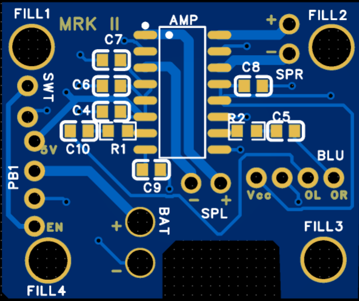
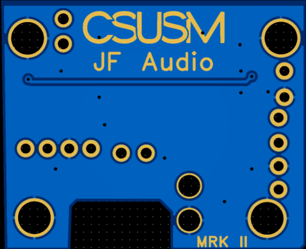
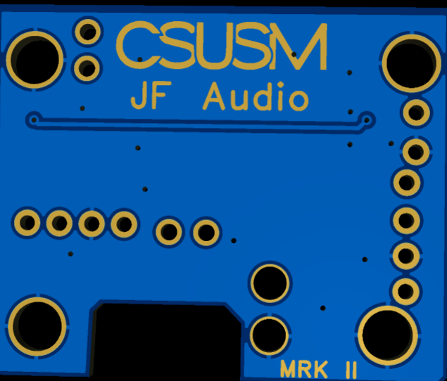

# JF Audio Version 2 - PCB Design Notes

## Overview

The JF Audio Version 2 PCB was designed to replace the breadboard-based wiring used in Version 1 with a more compact, organized, and permanent electrical system.

Version 1 successfully demonstrated the operation of the Bluetooth speaker, but the use of a breadboard, jumper wires, and separate modules required a significant amount of enclosure space and resulted in a large number of point-to-point connections.

Version 2 moves these connections onto a custom printed circuit board while also integrating the audio amplifier circuitry directly onto the PCB.

The PCB was designed and routed using EasyEDA and was submitted for fabrication after completing Design Rule Checking (DRC).

---

## Design Objectives

The primary objectives of the PCB were:

- Replace breadboard wiring with PCB traces
- Reduce the amount of point-to-point wiring
- Integrate the audio amplifier circuitry directly onto the PCB
- Provide dedicated connections for the Bluetooth module
- Provide dedicated left and right speaker connections
- Provide connections for the rechargeable power system
- Improve power and ground distribution
- Use wider traces for higher-current paths
- Maintain organized audio and power routing
- Create a PCB that can be mounted inside a dedicated enclosure
- Gain experience with schematic capture, footprint creation, PCB routing, vias, copper regions, and DRC

---

# PCB Design

## Top PCB Layout

The top PCB layout shows the component footprints, copper traces, through-hole connections, mounting holes, and amplifier circuitry.

The amplifier was positioned near the center of the PCB with its supporting passive components located nearby. Connections for the Bluetooth module, speakers, battery, external switch, and power system were positioned around the perimeter of the board where practical.

Component placement was selected to keep related components close together and reduce unnecessary trace lengths.

---

## Top PCB 3D Model

The EasyEDA 3D model was used to inspect the physical arrangement of the components before the PCB was submitted for fabrication.

The 3D model helped verify:

- Component placement
- Component orientation
- Connector locations
- Component spacing
- Mounting-hole locations
- Silkscreen placement
- Overall PCB dimensions and proportions

This provided an additional design review before manufacturing the physical board.

---

## Bottom PCB Layout

The bottom PCB layout contains additional routing, vias, through-hole connections, and project identification.

The use of both PCB layers made it possible to route connections that would have been difficult to complete entirely on a single layer.

Vias were used where necessary to transition electrical connections between the top and bottom copper layers.

---

## Bottom PCB 3D Model

The bottom side of the PCB includes custom project identification.

The silkscreen includes:

- CSUSM
- JF Audio
- MRK II

The **MRK II** designation identifies the PCB as part of the second major hardware revision of the JF Audio speaker.

---

# Audio System

## Audio Amplifier Section

Unlike Version 1, which used a complete PAM8403 amplifier module, Version 2 integrates the audio amplifier IC and its supporting components directly onto the custom PCB.

This reduces dependence on a separate amplifier breakout board and allows the amplifier circuitry to become part of the main speaker PCB.

The supporting passive components were positioned near the amplifier where practical to reduce unnecessary trace lengths and maintain an organized audio section.

---

## Audio Signal Routing

The PCB provides separate left and right audio paths between the Bluetooth receiver and the amplifier.

The signal flow can be represented as:

Bluetooth Receiver

↓

Left / Right Audio Signals

↓

Audio Amplifier

↓

Left / Right Amplified Outputs

↓

Speakers

The audio-input traces were routed separately from the higher-current speaker-output paths where practical.

---

## Speaker Outputs

The amplifier provides separate positive and negative outputs for each speaker channel.

The PCB therefore provides connections for:

- Left Speaker +
- Left Speaker -
- Right Speaker +
- Right Speaker -

Each speaker connects between the positive and negative amplifier outputs for its corresponding channel.

The negative speaker terminals are amplifier outputs and are **not connected directly to ground**.

Wider traces were used for the speaker-output paths because these connections can carry more current than the low-level audio-input signals.

---

# Power System

## Power Architecture

Version 2 moves away from the four-AA battery system used in Version 1 and introduces a rechargeable battery architecture.

The external power circuitry provides the required supply voltage for the PCB, which is then distributed to the Bluetooth receiver and amplifier circuitry.

This addresses one of the major limitations of Version 1, which did not include an integrated rechargeable battery system.

---

## Power Routing

Power traces were made wider than low-current signal traces where practical.

Particular attention was given to higher-current connections such as:

- Main power input
- Amplifier power
- Speaker outputs
- Battery/power connections

Using wider copper traces reduces resistance and improves the ability of the PCB to carry current.

---

# Grounding

Ground distribution was an important consideration during PCB layout.

A copper ground region was used to provide a common low-impedance ground connection across the PCB and reduce the need for long individual ground traces.

The Bluetooth receiver, amplifier circuitry, power system, and supporting passive components ultimately share the system ground.

Grounding was also considered during audio routing because poor ground connections can contribute to unwanted noise in an audio system.

---

# Component Placement

## Amplifier Components

The components associated with the amplifier were grouped together near the amplifier IC.

This helps:

- Reduce unnecessary trace lengths
- Keep the amplifier section organized
- Simplify routing
- Keep supporting components close to their associated IC pins

---

## Capacitor Placement

Capacitor placement was an important consideration during PCB design.

Power-related capacitors were placed close to the amplifier and associated supply connections where practical.

This reduces the distance between the amplifier and its local energy-storage and decoupling components.

A larger bulk capacitor is also included on the power rail to help support the amplifier during changing load conditions.

---

# PCB Routing

## Trace Widths

Different trace widths were selected depending on the expected function of each connection.

### Wider Traces

Wider traces were used for higher-current connections such as:

- Main power distribution
- Amplifier power
- Battery/power connections
- Left speaker output
- Right speaker output

### Signal Traces

Smaller traces were used for lower-current connections such as:

- Left audio input
- Right audio input
- Control connections
- Other low-current signals

This allowed more copper to be dedicated to higher-current paths while keeping the remaining PCB routing manageable.

---

## Via Usage

Vias were used where necessary to transition traces between the top and bottom copper layers.

Several routing areas around the amplifier and other connections were difficult to complete on a single PCB layer.

Using vias allowed traces to move to the opposite layer, pass around existing routing, and return to the original layer when necessary.

This provided additional routing flexibility while maintaining the required electrical connections.

---

# Footprint Development

Several component and footprint configurations required additional work during the design process.

Custom components and footprints were created in EasyEDA where necessary.

One issue encountered during development was EasyEDA reporting that a component lacked a footprint even though a footprint had already been created.

This required verifying that the correct footprint was actually assigned to the corresponding schematic component rather than relying only on matching component and footprint names.

This provided practical experience with the relationship between:

- Schematic symbols
- PCB footprints
- Physical components
- Pad assignments
- Net assignments

---

# Routing and Net Troubleshooting

Several routing and net-related issues were encountered during PCB development.

Some connections appeared correct visually but were still reported as electrically disconnected.

Troubleshooting involved checking:

- Net assignments
- Net names
- Pad assignments
- Physical trace connections
- Layer transitions
- Via connections
- Copper continuity
- Clearance requirements

Vias were used in difficult routing areas to transition between PCB layers and complete the required electrical connections.

This demonstrated that matching net labels alone do not guarantee that a continuous physical copper connection exists on the PCB.

---

# Design Rule Checking

Design Rule Checking was performed throughout the PCB development process.

DRC was used to identify potential problems including:

- Unconnected nets
- Routing conflicts
- Clearance violations
- Copper-region issues
- Via-related problems
- Other PCB design-rule violations

Each reported issue was investigated and corrected.

The final PCB design reached:

**0 DRC Errors**

before being submitted for manufacturing.

---

# Silkscreen and Board Identification

The PCB includes custom silkscreen markings to identify the project and board revision.

The bottom side includes:

**CSUSM**

**JF Audio**

**MRK II**

These markings distinguish Version 2 from the original JF Audio prototype and provide identification for the custom PCB.

---

# Manufacturing Preparation

Before submitting the PCB for fabrication, the design was reviewed for:

- Component placement
- Component orientation
- Trace routing
- Power connections
- Speaker connections
- Audio connections
- Ground connectivity
- Via placement
- Footprint assignments
- Silkscreen placement
- Mounting-hole placement
- Design Rule Check results

After the final review and successful DRC, the PCB was submitted for manufacturing.

The fabrication files are being kept separately from the public project documentation.

---

# Planned Hardware Verification

Once the manufactured PCB is received, the board will be inspected and electrically tested before full operation.

The planned verification process includes:

1. Visually inspect the PCB for manufacturing defects.
2. Verify important connections using continuity testing.
3. Check for shorts between the power rail and ground.
4. Verify battery and power connections.
5. Verify the regulated power supply before connecting the complete system.
6. Verify amplifier power connections.
7. Verify Bluetooth-module connections.
8. Verify left and right speaker connections.
9. Perform initial power-up testing.
10. Test Bluetooth connectivity.
11. Test the left audio channel.
12. Test the right audio channel.
13. Check for unwanted audio noise or distortion.
14. Test the rechargeable power system.
15. Install and test the PCB inside the final enclosure.

Test results will be documented after assembly.

---

# Improvements Over Version 1

| Version 1 | Version 2 |
|---|---|
| Breadboard-based construction | Custom PCB |
| PAM8403 amplifier module | Amplifier circuitry integrated onto PCB |
| Large number of jumper wires | PCB trace routing |
| Four AA batteries | Rechargeable battery system |
| No integrated battery charging | Rechargeable power architecture |
| Modified food container | Dedicated plastic enclosure |
| Large internal wiring footprint | More compact electrical system |
| Prototype-oriented construction | More permanent hardware design |

The custom PCB represents one of the largest improvements between the two versions because it replaces much of the point-to-point wiring used in the original prototype.

---

# Current Status

- [x] PCB schematic/design completed
- [x] Component footprints configured
- [x] Component placement completed
- [x] PCB routing completed
- [x] Vias added where required
- [x] Ground copper implemented
- [x] Power and speaker trace widths reviewed
- [x] DRC errors resolved
- [x] PCB submitted for manufacturing
- [x] Components ordered
- [ ] Manufactured PCB received
- [ ] PCB visually inspected
- [ ] PCB continuity tested
- [ ] Components assembled
- [ ] Initial power-up completed
- [ ] Bluetooth functionality tested
- [ ] Left audio channel tested
- [ ] Right audio channel tested
- [ ] Rechargeable power system tested
- [ ] Final enclosure assembly completed

---

# Summary

The JF Audio Version 2 PCB represents the transition from the breadboard-based proof of concept developed in Version 1 to a purpose-built hardware design.

The PCB design process provided practical experience with schematic development, custom footprints, component placement, trace routing, trace sizing, grounding, copper regions, vias, design-rule checking, and preparing a custom PCB for manufacturing.

The next stage of the project will focus on inspecting the manufactured PCB, assembling the hardware, performing electrical measurements, testing the audio system, troubleshooting any issues, and integrating the completed electronics into the Version 2 enclosure.
