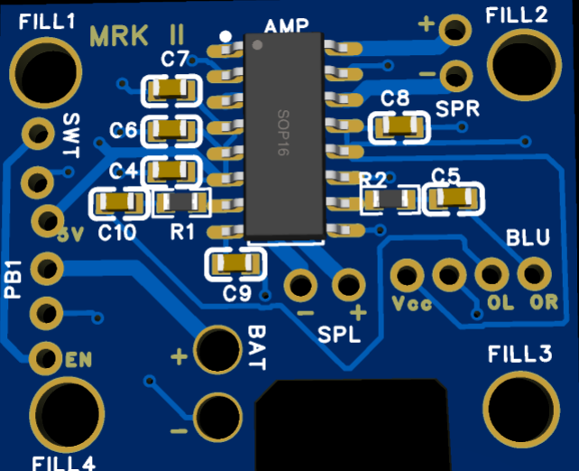

# JF Audio Version 2 - Custom PCB

## Overview

Version 2 of JF Audio is the second major revision of my portable Bluetooth speaker project. This version builds upon the working Version 1 prototype by replacing the breadboard-based construction with a custom PCB and a more integrated rechargeable power system.

Version 1 successfully demonstrated the basic Bluetooth speaker architecture, but the breadboard, jumper wires, AA battery system, and modified food-container enclosure introduced limitations in size, organization, reliability, and usability.

Version 2 was designed to address these limitations while providing experience with PCB schematic capture, PCB layout and routing, component selection, design-rule checking, PCB manufacturing, rechargeable battery systems, and hardware integration.

---

## Design Goals

- Replace the breadboard and jumper-wire construction with a custom PCB
- Reduce the amount of internal wiring
- Improve electrical and mechanical organization
- Implement a rechargeable lithium-ion battery system
- Improve power distribution and grounding
- Create more reliable electrical connections
- Use a dedicated plastic electronics enclosure
- Improve the overall appearance and portability of the speaker
- Gain experience designing and manufacturing a custom PCB
- Apply lessons learned from Version 1

---

## Major Improvements Over Version 1

| Version 1 | Version 2 |
|---|---|
| Breadboard construction | Custom PCB |
| Large number of jumper wires | PCB traces and dedicated connectors |
| 4x AA battery pack | Rechargeable lithium-ion battery |
| No integrated charging | Rechargeable power system |
| Modified food container | Dedicated plastic enclosure |
| Prototype-oriented construction | More permanent hardware |
| Large internal wiring footprint | More compact electrical layout |

---

## System Architecture

Version 2 maintains the same general Bluetooth audio architecture demonstrated successfully in Version 1 while redesigning the power system and physical implementation.

The major sections of the system are:

1. Rechargeable battery system
2. Power management and 5 V supply
3. Bluetooth audio receiver
4. Stereo audio amplifier
5. Left and right speakers
6. Custom PCB
7. External power control

### General Signal Flow

`Bluetooth Audio → Audio Amplifier → Left/Right Speakers`

### General Power Flow

`Rechargeable Li-ion Battery → Power/Charging System → 5 V Electronics Supply → Bluetooth Receiver + Audio Amplifier`

---

## Custom PCB

One of the primary improvements introduced in Version 2 is the replacement of the Version 1 breadboard with a custom printed circuit board.

The PCB was designed to integrate the electrical connections required by the Bluetooth audio system while reducing the amount of point-to-point wiring inside the enclosure.

The PCB design process included:

- Component placement
- Custom component footprints
- Power and signal routing
- Ground-plane implementation
- Trace-width selection
- Speaker-output routing
- Battery and power routing
- Via placement
- Design Rule Checking (DRC)
- PCB manufacturing preparation

The final PCB passed the configured design-rule checks before being submitted for manufacturing.

---

## PCB Layout

The custom PCB was designed in EasyEDA to integrate the PAM8403 stereo
audio amplifier, Bluetooth connections, power connections, and speaker outputs.

### PCB Design

  

### Manufactured PCB

  

The PCB uses wider traces for higher-current paths such as power and
speaker connections. Copper ground regions were incorporated to simplify
ground routing and provide a common ground reference.

---

## Power System

Version 2 replaces the four-AA battery system used in Version 1 with a rechargeable lithium-ion battery system.

The design uses an Adafruit PowerBoost 1000C to provide power management for the portable speaker.

This change is intended to eliminate two major limitations discovered during Version 1:

1. The batteries could not be recharged directly inside the speaker.
2. The Version 1 internal power module required manual activation before the external power switch could control the speaker.

The rechargeable system provides a more practical power architecture for a portable device.

---

## Audio System

The audio section receives stereo audio from the Bluetooth module and sends the left and right signals to the audio amplifier.

The amplifier then drives the left and right speakers using separate output channels.

The custom PCB provides the electrical connections between the Bluetooth receiver, amplifier circuitry, power system, and external speaker connections.

---

## Enclosure

Version 2 replaces the modified food container used in Version 1 with a dedicated plastic electronics enclosure.

The new enclosure is intended to provide:

- Improved component mounting
- Better protection for the electronics
- Cleaner external appearance
- More organized internal construction
- Improved portability
- More permanent mounting of switches, speakers, and electrical hardware

The enclosure layout is currently being developed around the manufactured
PCB, PowerBoost module, rechargeable battery system, speakers, and external
power switch. Final mounting will be completed after power-system testing
and full electrical validation are complete.

---

## Parts List

A complete Version 2 parts list will be maintained in the `Parts/` directory.

Major components include:

- Custom JF Audio PCB
- Bluetooth audio module
- Audio amplifier circuitry
- Two speakers
- Rechargeable lithium-ion battery
- Adafruit PowerBoost 1000C
- Plastic electronics enclosure
- External power switch
- PCB connectors
- Passive components
- Mounting hardware

---

## PCB Design Process

Version 2 provided experience moving from a prototype circuit to a manufacturable PCB.

Several design issues were identified and corrected during development, including:

- Component footprint configuration
- Schematic-to-PCB net consistency
- Net-name mismatches
- Unrouted connections
- Via routing
- Copper-region clearance
- Trace clearance
- Battery and speaker trace widths
- Design Rule Check errors

Resolving these issues was an important part of preparing the board for manufacturing.

---

## Manufacturing and Assembly

The Version 2 PCB was successfully manufactured and received for assembly.

After receiving the board, the PCB was visually inspected and continuity
tests were performed before power was applied. Components were then
installed and the board was integrated with the Bluetooth module,
PowerBoost 1000C, battery system, and speakers.

Assembly included:

- PAM8403 stereo amplifier IC
- Passive amplifier components
- Bluetooth module connections
- Left and right speaker connections
- Power and ground wiring
- PowerBoost 1000C integration
- External power-control wiring

The assembled PCB successfully produced stereo audio during initial bench
testing.

---

## Hardware Testing

Initial bench testing was performed incrementally to verify each subsystem
before final enclosure installation.

Testing completed so far includes:

- [x] PCB continuity inspection
- [x] Power and ground continuity checks
- [x] Initial ~5.1 V supply verification
- [x] Bluetooth module power-up
- [x] Bluetooth pairing
- [x] Left-channel audio verification
- [x] Right-channel audio verification
- [x] Stereo speaker operation
- [ ] Replacement PowerBoost verification
- [ ] Battery protection integration
- [ ] Power-switch verification
- [ ] Charging-system verification
- [ ] Extended playback testing
- [ ] Final enclosure testing

The Bluetooth and audio portions of the system successfully operated during
bench testing, including simultaneous operation of both speaker channels.

During later power-system testing, abnormal heating was observed in the
PowerBoost 1000C boost-converter circuitry. Testing was stopped and the
module was removed from service rather than continuing to operate the
system under the abnormal condition.

Troubleshooting and test measurements are documented in
[Hardware_Testing.md](Testing/Hardware_Testing.md).

---

## Engineering Challenges

Version 2 introduced several practical challenges that were not present
during the breadboard prototype.

These included:

- Designing and verifying custom component footprints
- Routing power, audio, and speaker connections on a compact PCB
- Correcting schematic and PCB net inconsistencies
- Hand-soldering small surface-mount components
- Integrating separate power-management and audio subsystems
- Troubleshooting power-control behavior
- Diagnosing abnormal PowerBoost operation during bench testing
- Balancing PCB size with accessibility for soldering and wiring

These challenges provided experience in hardware debugging, PCB assembly,
electrical measurement, and iterative design beyond the initial schematic
and PCB-layout stages.

---

## Lessons From Version 1 Applied to Version 2

Version 1 demonstrated that the Bluetooth speaker architecture worked, but also identified several areas requiring improvement.

Version 2 directly addresses these findings through:

- Replacing breadboard wiring with PCB traces
- Reducing internal jumper wiring
- Improving component organization
- Adding rechargeable battery operation
- Improving power distribution
- Using a dedicated enclosure
- Creating a more permanent electrical assembly

The transition from Version 1 to Version 2 represents the progression from a functional proof-of-concept prototype toward a more integrated hardware design.

---

## Project Files

- [PCB Design Documentation](PCB/PCB_Design_Notes.md) - PCB design process, layout decisions, manufacturing results, and design notes
- [PCB Photos](PCB/Photos/) - 2D/3D PCB renders and photographs of the manufactured board
- [Parts List](Parts/Parts_List.md) - Version 2 bill of materials and component information
- [Schematics](Schematics/) - Electrical schematics and supporting design files
- [Hardware Testing](Testing/Hardware_Testing.md) - Bench testing, measurements, troubleshooting, and hardware verification

---

## Current Status

**In Development — Hardware Integration and Testing**

- [x] Version 1 prototype completed
- [x] Version 2 architecture developed
- [x] Custom PCB designed
- [x] PCB routing completed
- [x] Design Rule Check completed
- [x] PCB manufactured and received
- [x] PCB visually inspected
- [x] Components assembled
- [x] PCB continuity tested
- [x] Initial power testing performed
- [x] Bluetooth module powered and paired
- [x] Left audio channel tested
- [x] Right audio channel tested
- [x] Stereo audio operation verified
- [x] PowerBoost fault identified during testing
- [ ] Replacement PowerBoost tested
- [ ] Battery protection system integrated
- [ ] Power switch validated
- [ ] Charging operation validated
- [ ] Enclosure assembled
- [ ] Extended playback testing
- [ ] Final Version 2 validation
---

## Next Steps

The next stage of Version 2 focuses on completing power-system validation
and final hardware integration.

Planned work includes:

1. Install and independently test the replacement PowerBoost 1000C
2. Verify stable 5 V output before connecting the remaining electronics
3. Integrate the battery protection system
4. Reconnect and test the custom PCB
5. Verify Bluetooth and stereo audio operation
6. Validate external power-switch operation
7. Test battery charging
8. Install hardware into the enclosure
9. Perform extended playback and final system testing
10. Document final measurements and completed assembly

Results from these tests will be added to the hardware-testing documentation
as development continues.
