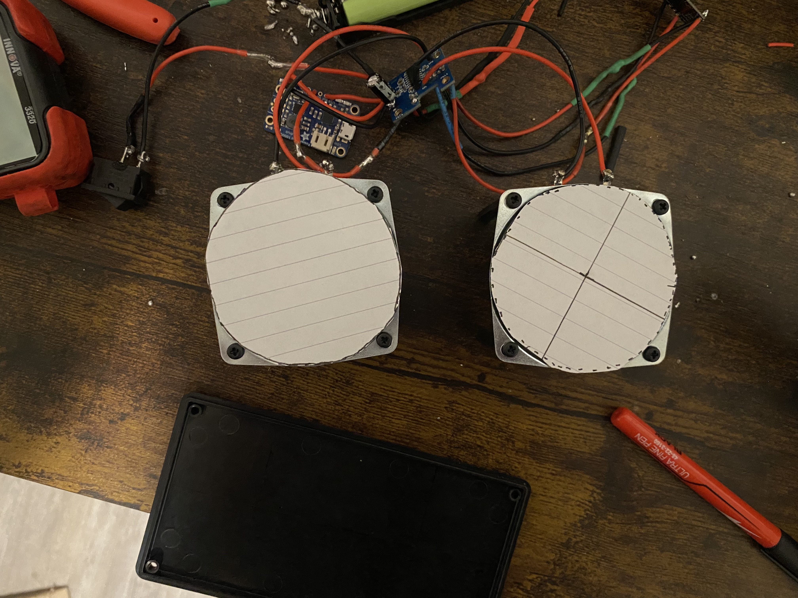
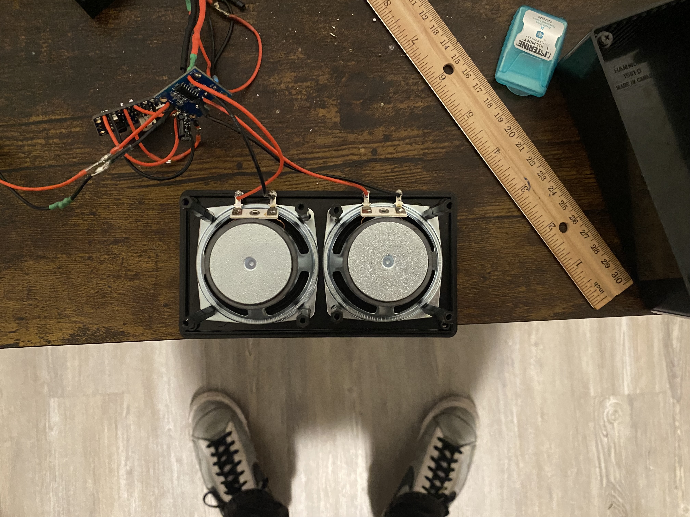
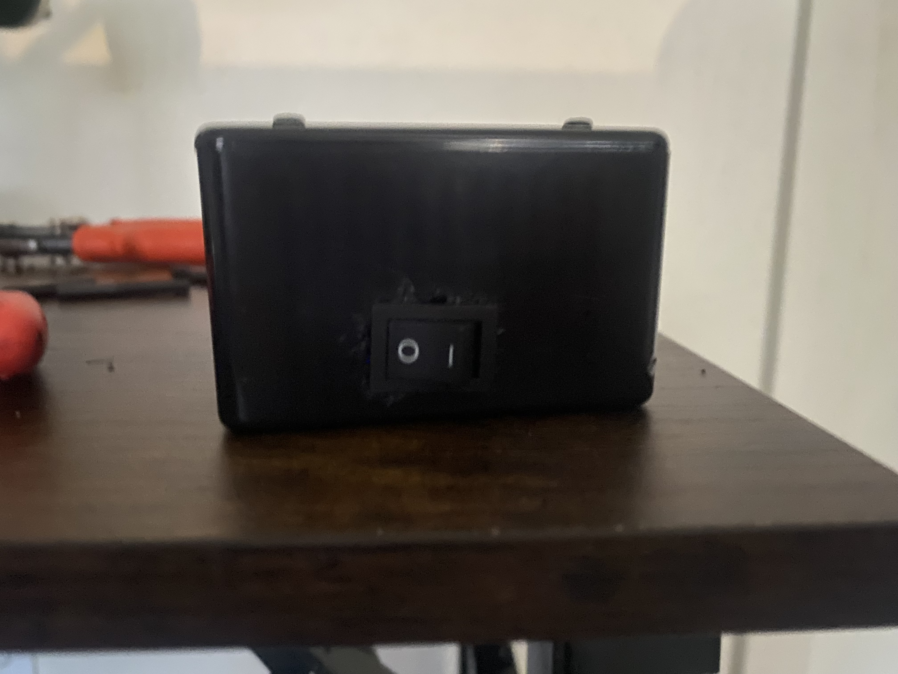

# JF Audio Version 2 - Custom PCB

## Overview

Version 2 of JF Audio is the second major revision of my portable Bluetooth speaker project. This version builds upon the working Version 1 prototype by replacing the breadboard-based construction with a custom PCB and a more integrated rechargeable power system.

Version 1 successfully demonstrated the basic Bluetooth speaker architecture, but the breadboard, jumper wires, AA battery system, and modified food-container enclosure introduced limitations in size, organization, reliability, and usability.

Version 2 was designed to address these limitations while providing experience with PCB schematic capture, PCB layout and routing, component selection, design-rule checking, PCB manufacturing, rechargeable battery systems, and hardware integration.

---

*Completed JF Audio Version 2 Bluetooth speaker following PCB, power-system,
and enclosure integration.*

## Design Goals

- Replace the breadboard and jumper-wire construction with a custom PCB
- Reduce the amount of internal wiring
- Improve electrical and mechanical organization
- Implement a rechargeable lithium-ion battery system
- Improve power distribution and grounding
- Create more reliable electrical connections
- Use a dedicated plastic electronics enclosure
- Improve the overall appearance and portability of the speaker
- Gain experience designing and manufacturing a custom PCB
- Apply lessons learned from Version 1

---

## Major Improvements Over Version 1

| Version 1 | Version 2 |
|---|---|
| Breadboard construction | Custom PCB |
| Large number of jumper wires | PCB traces and dedicated connectors |
| 4x AA battery pack | Rechargeable lithium-ion battery |
| No integrated charging | Rechargeable power system |
| Modified food container | Dedicated plastic enclosure |
| Prototype-oriented construction | More permanent hardware |
| Large internal wiring footprint | More compact electrical layout |

---

## System Architecture

Version 2 maintains the same general Bluetooth audio architecture demonstrated successfully in Version 1 while redesigning the power system and physical implementation.

The major sections of the system are:

1. Rechargeable battery system
2. Power management and 5 V supply
3. Bluetooth audio receiver
4. Stereo audio amplifier
5. Left and right speakers
6. Custom PCB
7. External power control

### General Signal Flow

`Bluetooth Audio → Audio Amplifier → Left/Right Speakers`

### General Power Flow

`Rechargeable Li-ion Battery → Power/Charging System → 5 V Electronics Supply → Bluetooth Receiver + Audio Amplifier`

---

## Schematics

The Version 2 electrical schematic was developed in EasyEDA and used as the
basis for the custom PCB design.

The schematic documents the PAM8403 amplifier circuitry, power connections,
audio inputs, speaker outputs, and supporting passive components.

Additional LTspice files used during design or simulation are included
separately where applicable.

- [View Schematics](Schematics/)

  ---

## Custom PCB

One of the primary improvements introduced in Version 2 is the replacement of the Version 1 breadboard with a custom printed circuit board.

The PCB was designed to integrate the electrical connections required by the Bluetooth audio system while reducing the amount of point-to-point wiring inside the enclosure.

The PCB design process included:

- Component placement
- Custom component footprints
- Power and signal routing
- Ground-plane implementation
- Trace-width selection
- Speaker-output routing
- Battery and power routing
- Via placement
- Design Rule Checking (DRC)
- PCB manufacturing preparation

The final PCB passed the configured design-rule checks before being submitted for manufacturing.

---

## PCB Layout

The custom PCB was designed in EasyEDA to integrate the PAM8403 stereo
audio amplifier, Bluetooth connections, power connections, and speaker outputs.

### PCB Design

  

### Manufactured PCB

  

The PCB uses wider traces for higher-current paths such as power and
speaker connections. Copper ground regions were incorporated to simplify
ground routing and provide a common ground reference.

---

## Power System

Version 2 replaces the four-AA battery system used in Version 1 with a rechargeable lithium-ion battery system.

The design uses an Adafruit PowerBoost 1000C to provide power management for the portable speaker.

This change is intended to eliminate two major limitations discovered during Version 1:

1. The batteries could not be recharged directly inside the speaker.
2. The Version 1 internal power module required manual activation before the external power switch could control the speaker.

The rechargeable system provides a more practical power architecture for a portable device.

---

## Audio System

The audio section receives stereo audio from the Bluetooth module and sends the left and right signals to the audio amplifier.

The amplifier then drives the left and right speakers using separate output channels.

The custom PCB provides the electrical connections between the Bluetooth receiver, amplifier circuitry, power system, and external speaker connections.

---

## Enclosure

The Version 2 electronics were integrated into a Hammond 1591D enclosure.

The enclosure was selected to provide enough space for the two speakers,
battery system, PowerBoost 1000C, custom amplifier PCB, Bluetooth receiver,
and supporting electronics.

### Speaker Layout and Mounting

*Speaker cutout templates used during enclosure layout and fabrication.*

*Rear view of the two speakers after mechanical installation.*

### External Interfaces

Openings were manually created for the charging connection and external
power switch.

*Externally mounted rocker switch used for system power control.*

### Internal Component Integration

The internal electronics were installed within the enclosure while
maintaining access to the power, charging, audio, and speaker connections.

*Final internal arrangement of the Version 2 electronics.*

### Mechanical Design Observations

Manual modification of the off-the-shelf enclosure successfully allowed
the Version 2 electronics to be integrated into a portable package.
However, the speaker and external-interface openings were more difficult
to fabricate precisely than anticipated.

These observations motivated a major design goal for Version 3: development
of a custom 3D-printed enclosure with accurately dimensioned speaker
openings,

---

## Parts List

A complete Version 2 parts list will be maintained in the `Parts/` directory.

Major components include:

- Custom JF Audio PCB
- Bluetooth audio module
- Audio amplifier circuitry
- Two speakers
- Rechargeable lithium-ion battery
- Adafruit PowerBoost 1000C
- Plastic electronics enclosure
- External power switch
- PCB connectors
- Passive components
- Mounting hardware

---

## PCB Design Process

Version 2 provided experience moving from a prototype circuit to a manufacturable PCB.

Several design issues were identified and corrected during development, including:

- Component footprint configuration
- Schematic-to-PCB net consistency
- Net-name mismatches
- Unrouted connections
- Via routing
- Copper-region clearance
- Trace clearance
- Battery and speaker trace widths
- Design Rule Check errors

Resolving these issues was an important part of preparing the board for manufacturing.

---

## PCB Manufacturing and Assembly

The custom Version 2 PCB was successfully manufactured and received.

Following manufacturing, the board underwent visual inspection and electrical testing before full system integration.

The assembly and bring-up process included:

1. Visual inspection of the manufactured PCB
2. Continuity testing
3. Verification of power and ground connections
4. Hand-soldering of surface-mount components
5. Initial PCB power testing
6. Integration of the PowerBoost 1000C
7. Integration of the battery protection circuit
8. Bluetooth receiver integration
9. Left and right speaker testing
10. Full battery-powered system testing

Several hardware issues were encountered during bring-up and troubleshooting. These were investigated through continuity measurements, voltage measurements, component inspection, and subsystem testing.

The completed electrical system successfully operates as a rechargeable, battery-powered Bluetooth speaker.

---

## Testing

Version 2 has undergone subsystem and integrated hardware testing.

Completed testing includes:

- PCB continuity testing
- Power and ground verification
- PowerBoost output testing
- Bluetooth pairing
- Left/right audio-channel verification
- External power-switch operation
- Battery protection circuit integration
- Battery-powered operation
- 15-minute initial playback test
- 1-hour extended playback test
- Battery charging test
- Full-charge verification
- Simultaneous charging and audio playback

The system successfully completed approximately one hour of continuous battery-powered playback without abnormal component overheating or unexpected shutdown.

Following the extended playback test, the battery measured approximately **3.77 V**.

Charging functionality was subsequently verified, with the battery reaching approximately **4.18 V** at charge completion.

The speaker was also successfully operated while connected to charging power.

Detailed measurements and test results are documented in the `Testing/` directory.

---

## Engineering Challenges

Version 2 introduced several practical challenges that were not present
during the breadboard prototype.

These included:

- Designing and verifying custom component footprints
- Routing power, audio, and speaker connections on a compact PCB
- Correcting schematic and PCB net inconsistencies
- Hand-soldering small surface-mount components
- Integrating separate power-management and audio subsystems
- Troubleshooting power-control behavior
- Diagnosing abnormal PowerBoost operation during bench testing
- Balancing PCB size with accessibility for soldering and wiring

These challenges provided experience in hardware debugging, PCB assembly,
electrical measurement, and iterative design beyond the initial schematic
and PCB-layout stages.

---

## Lessons From Version 1 Applied to Version 2

Version 1 demonstrated that the Bluetooth speaker architecture worked, but also identified several areas requiring improvement.

Version 2 directly addresses these findings through:

- Replacing breadboard wiring with PCB traces
- Reducing internal jumper wiring
- Improving component organization
- Adding rechargeable battery operation
- Improving power distribution
- Using a dedicated enclosure
- Creating a more permanent electrical assembly

The transition from Version 1 to Version 2 represents the progression from a functional proof-of-concept prototype toward a more integrated hardware design.

---

## Project Files

- [PCB Design Documentation](PCB/PCB_Design_Notes.md) - PCB design process, layout decisions, manufacturing results, and design notes
- [PCB Photos](PCB/Photos/) - 2D/3D PCB renders and photographs of the manufactured board
- [Parts List](Parts/Parts_List.md) - Version 2 bill of materials and component information
- [Schematics](Schematics/) - Electrical schematics and supporting design files
- [Hardware Testing](Testing/Hardware_Testing.md) - Bench testing, measurements, troubleshooting, and hardware verification

---

## Current Status

**Version 2 - Final Testing**

- [x] Version 2 architecture developed
- [x] Custom PCB designed
- [x] PCB manufactured and received
- [x] PCB assembled and electrically tested
- [x] Battery protection system integrated
- [x] Replacement PowerBoost installed and tested
- [x] External power switch tested
- [x] Bluetooth pairing verified
- [x] Stereo audio playback verified
- [x] 1-hour bench playback test completed
- [x] Battery charging verified
- [x] Full-charge operation verified
- [x] Simultaneous charging and playback verified
- [x] Speaker openings cut
- [x] Speaker mounting holes drilled
- [x] Speakers mounted
- [x] Charging-port opening completed
- [x] External power switch mounted
- [x] Internal electronics installed
- [x] Enclosure assembled
- [x] 2.5-hour post-assembly playback test completed
- [ ] Final charging test after enclosure assembly
- [ ] Final charging + playback test after enclosure assembly
- [ ] Final inspection
- [ ] Version 2 completed
      
## Next Steps

The next stage of Version 2 focuses on completing power-system validation
and final hardware integration.

Planned work includes:

1. Install and independently test the replacement PowerBoost 1000C
2. Verify stable 5 V output before connecting the remaining electronics
3. Integrate the battery protection system
4. Reconnect and test the custom PCB
5. Verify Bluetooth and stereo audio operation
6. Validate external power-switch operation
7. Test battery charging
8. Install hardware into the enclosure
9. Perform extended playback and final system testing
10. Document final measurements and completed assembly

Results from these tests will be added to the hardware-testing documentation
as development continues.
