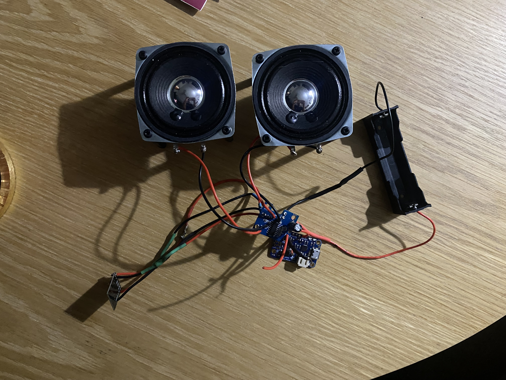
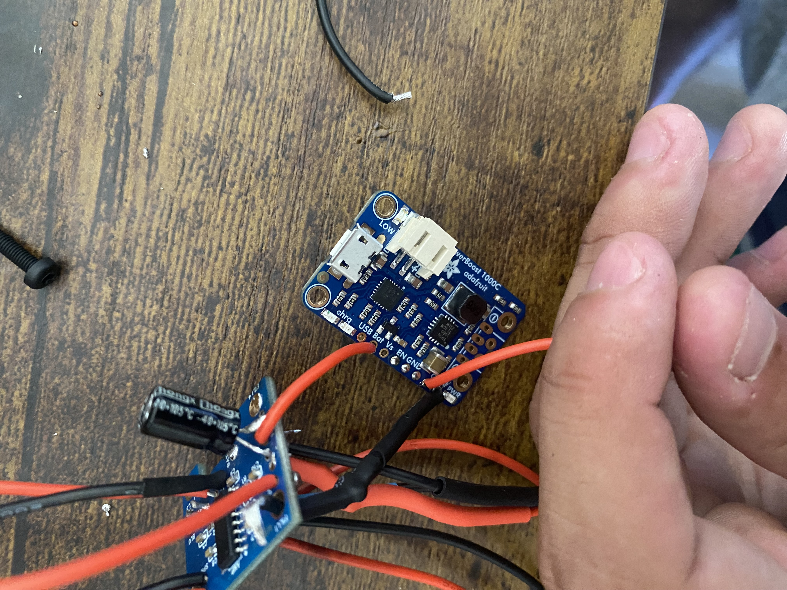
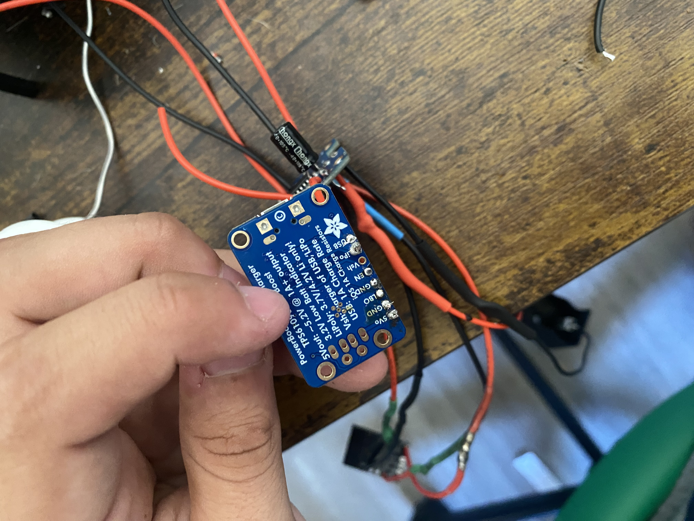
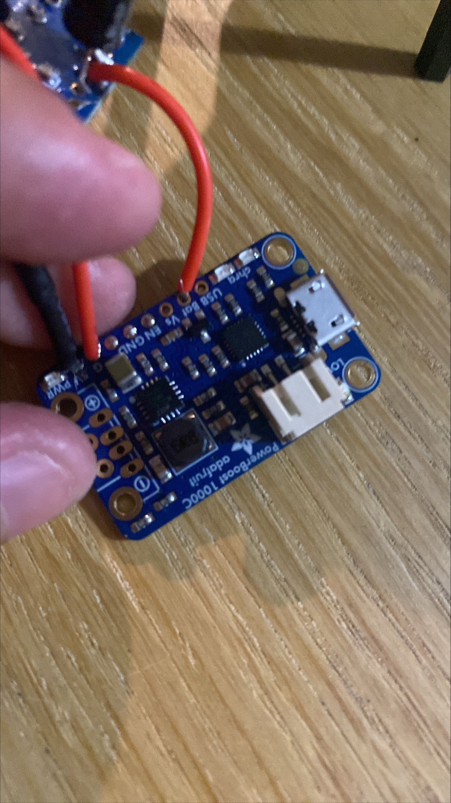

# JF Audio Version 2 - Hardware Testing

## Overview

This document records the hardware bring-up, electrical testing, audio verification, and troubleshooting performed on the JF Audio Version 2 system.

Testing was performed incrementally to verify each subsystem before final enclosure assembly.

The primary systems evaluated include:

- Custom JF Audio PCB
- PAM8403 stereo audio amplifier
- Bluetooth audio receiver
- Adafruit PowerBoost 1000C
- 3.7 V 18650 lithium-ion battery system
- Left and right speakers
- Power and ground distribution

Testing is still in progress as the Version 2 hardware is assembled and refined.

---

## Initial Bench Setup

The Version 2 electronics were tested outside of the final enclosure to allow
individual subsystems to be measured and verified before permanent installation.

This bench configuration included the custom JF Audio PCB, Bluetooth receiver,
PAM8403 amplifier, PowerBoost 1000C, 18650 battery system, and both speakers.

---

# PCB Inspection and Continuity Testing

Before applying power, the manufactured PCB was visually inspected and tested using a digital multimeter.

Continuity testing was performed across the major power, ground, audio, and speaker connections.

## Results

- [x] PCB visually inspected
- [x] Power connections checked
- [x] Ground connections checked
- [x] Major signal connections checked
- [x] Speaker-output connections checked
- [x] No obvious 5 V-to-GND short detected

The continuity tests confirmed that the major PCB connections were electrically connected as intended before initial power-up.

---

# Initial Power Testing

The initial Version 2 power system used an Adafruit PowerBoost 1000C to convert the single-cell lithium-ion battery voltage to the regulated supply used by the custom PCB.

A 470 µF electrolytic bulk capacitor was connected externally across the regulated 5 V and GND rails after a PCB footprint issue prevented the intended capacitor from being installed directly at its original PCB location.

## Initial Voltage Measurements

| Measurement | Result | Status |
|---|---:|---|
| PowerBoost output | ~5.1 V | PASS |
| PCB 5 V rail | ~5.1 V | PASS |
| Voltage across 470 µF capacitor | ~5.1 V | PASS |

These measurements confirmed that the PowerBoost initially supplied the expected regulated voltage and that the supply successfully reached the custom PCB.

---

# Bluetooth Receiver Testing

After the power system and PCB supply voltage were verified, the Bluetooth receiver was connected to the custom PCB.

The Bluetooth module powered successfully and was detected by a mobile device.

## Results

- [x] Bluetooth module powered successfully
- [x] Bluetooth module operated normally
- [x] Mobile device detected the Bluetooth receiver
- [x] Bluetooth pairing completed successfully

Successful pairing confirmed that the Bluetooth receiver was receiving power and operating correctly when connected through the Version 2 hardware.

---

# Audio Amplifier Testing

After successful Bluetooth pairing, the PAM8403 amplifier channels were tested individually.

Testing one speaker channel at a time reduced the number of variables during initial audio verification.

## Left Audio Channel

The left speaker was connected to the left amplifier output and Bluetooth audio was played through the system.

### Results

- [x] Left speaker connected
- [x] Bluetooth audio received
- [x] PAM8403 left amplifier channel produced audio
- [x] Left speaker operated successfully

**Result: PASS**

---

## Right Audio Channel

After verifying the left channel, the right speaker was connected and tested.

### Results

- [x] Right speaker connected
- [x] Bluetooth audio received
- [x] PAM8403 right amplifier channel produced audio
- [x] Right speaker operated successfully

**Result: PASS**

---

# Stereo Audio Verification

Both speakers were successfully connected to the custom PCB and operated through the PAM8403 stereo amplifier.

The verified audio path was:

Bluetooth Receiver

↓

JF Audio Version 2 PCB

↓

PAM8403 Stereo Amplifier

↓

Left and Right Speakers

## Results

- [x] Left audio channel operational
- [x] Right audio channel operational
- [x] Both speakers operational

**Stereo Audio Test: PASS**

This represented the first successful stereo audio operation of the manufactured JF Audio Version 2 PCB.

---

# PowerBoost Wiring

### Top Side

### Bottom Side

The PowerBoost 1000C was integrated into the Version 2 power system to provide
the regulated supply required by the custom PCB.

Initial testing measured approximately 5.1 V at the PowerBoost output, PCB
power input, and external 470 µF bulk capacitor.

---

# PowerBoost Troubleshooting

During later testing of the external power-enable circuit, the PowerBoost
stopped producing the expected boosted output.

Troubleshooting measurements included:

- Battery input: approximately 3.8 V
- Boosted output: approximately 0 V
- LOW indicator remained illuminated
- Abnormal heating was observed near the boost-converter IC
- No obvious 0-ohm short was measured across the primary power rails

Because abnormal heating was observed, additional battery-powered testing of
the module was discontinued.

The exact cause of the failure has not been conclusively determined. A
replacement PowerBoost 1000C will be installed before additional system-level
testing is performed.

## Observed Behavior

The following observations were recorded:

- Battery voltage measured approximately 3.8 V
- PowerBoost boosted output measured approximately 0 V
- Red LOW indicator remained illuminated
- Abnormal heating was observed around the boost-converter IC
- No obvious 0-ohm short was measured across the primary power rails

Because the PowerBoost exhibited abnormal heating, additional battery-powered testing of the module was discontinued.

The exact cause of the failure has not been conclusively determined.

A replacement PowerBoost 1000C will be installed before additional system-level testing is performed.

---

# Battery Protection Improvement

During hardware bring-up, the selected 3.7 V 18650 lithium-ion cell was identified as an unprotected cell.

Because the battery does not contain an integrated protection circuit, a separate 1S lithium-ion battery protection module was added to the planned Version 2 power architecture.

The revised power architecture is:

18650 Battery

↓

1S Battery Protection Module

↓

PowerBoost 1000C

↓

JF Audio Version 2 PCB

The protection module will be installed and verified before final assembly.

This design change was made to improve battery protection and overall power-system robustness.

---

# Replacement PowerBoost Testing

The following tests will be performed when the replacement PowerBoost 1000C is installed.

## Power System

- [ ] Verify battery voltage
- [ ] Verify protected battery output
- [ ] Verify PowerBoost input voltage
- [ ] Verify PowerBoost regulated output
- [ ] Verify PCB supply voltage
- [ ] Verify voltage across 470 µF bulk capacitor
- [ ] Check for abnormal component heating

## Functional Retesting

- [ ] Verify Bluetooth module power
- [ ] Verify Bluetooth pairing
- [ ] Re-test left audio channel
- [ ] Re-test right audio channel
- [ ] Verify stereo audio operation

## Power Control

- [ ] Connect SPST rocker switch to PowerBoost enable control
- [ ] Verify ON state
- [ ] Verify OFF state
- [ ] Confirm correct switch orientation

---

# Final System Testing

After the replacement power system is verified, additional testing will include:

- [ ] Battery charging test
- [ ] Extended playback test
- [ ] Audio noise evaluation
- [ ] Audio distortion evaluation
- [ ] Amplifier temperature check
- [ ] Power-system temperature check
- [ ] Final wiring inspection
- [ ] Enclosure installation
- [ ] Final assembled-system power test
- [ ] Final Bluetooth test
- [ ] Final stereo playback test

---

# Testing Summary

Initial hardware bring-up successfully demonstrated that the JF Audio Version 2 custom PCB is capable of supporting the intended Bluetooth stereo audio system.

Successful testing included:

- PCB continuity verification
- Approximately 5.1 V regulated power delivery
- Successful Bluetooth operation and pairing
- Successful PAM8403 left-channel operation
- Successful PAM8403 right-channel operation
- Successful stereo speaker operation

A subsequent issue with the PowerBoost 1000C interrupted further power-system testing. Because abnormal heating was observed, the module was removed from service and will be replaced.

The hardware bring-up process also identified an improvement to the battery architecture through the addition of a dedicated 1S lithium-ion protection module.

Testing will continue after the replacement PowerBoost is installed and the revised battery protection system is verified.
